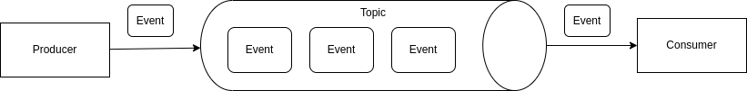

# Apache Kafka

Kafka is a distributed streaming platform. In a nutshell, Kafka is a broker from an Event-Driven Architecture that stores events (messages) continually in a distributed way.

The Kafka has 3 main components:

- __Topic__: Topic is where the kafka stores the events (messages). A topic is a log of events.
- __Producer__: Produce is an application that sends events (messages) to the topic.
- __Consumer__: Consumer is an application that receives (read / subscribe) events (messages) from the topic.

## Topics
 
Topics are the place where kafka stores events (messages). Topic is a log of events Doing an analogy, a relational database use table to store the records and kafka use topics to store the events.

The events are imutable after storing and they are stored in same order that they were written.

The kafka can have lots of topics from different applications, services or domains, each one serving a specific purpose.

__A topic is not a queue, it's a log.__ The difference between a topic and a queue is: In a queue, when the message is read, it is removed from the queue. In a topic, when the message is read, the message is still available in the topic for other consumers to read, or for reprocessing. The event duration is configurable and can be retained for days, weeks, or even months.

## Events

A kafka event structure is composed by:

- __key__: An identifier to the event. if the key is null, the event will be distributed evenly to all partitions using round-robin.
- __value__: A json value.
- __timestamp__: The timestamp when the record was registered.
- __Headers__: Additional metadata about the event structure by key and value.
- __topic__: The topic name.
- __partition__: The partition number.
- __offset__: A serial number that identify the event on the topic partition.

## Partitions

Partition is the way to distribute the same topic into different nodes in a cluster. A partition is like a sharding in a database.

The events are ordered by partition into the topic. Where each partition has its own offset.

If the event has no key, it will be distributed evenly to all partitions using the round-robin algorithm.

If the event has a key, kafka will use a hash function to determine which partition the event will be distributed. Similarly to database sharding.

